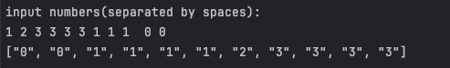

# 冒泡排序

## 代码结构
- 排序代码在lib.rs
- main.rs实现输入、调用排序、在输出
```
├── Cargo.lock
├── Cargo.toml
├── readme.md
├── src
│   ├── lib.rs
│   └── main.rs
```


## 核心代码
使用范型与`PartialOrd`实现
```rust
pub mod sort {
    pub fn bubble_sort<T: PartialOrd>(vx: &mut Vec<T>) {
        let n = vx.len();
        for i in 0..n {
            for j in 0..(n - i - 1) {
                if vx[j] > vx[j + 1] {
                    vx.swap(j, j + 1)
                }
            }
        }
    }
}
```
## 运行截图

